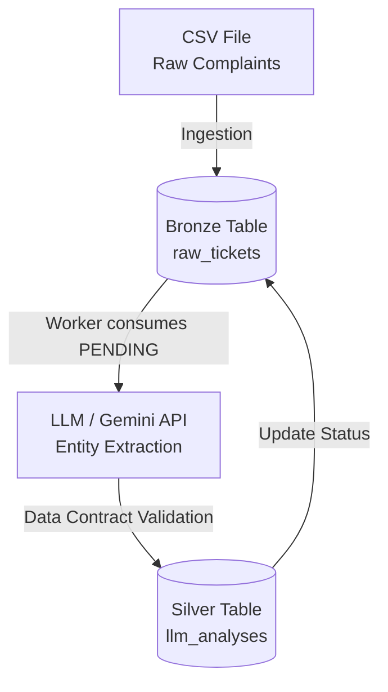

# AI Ticket Categorizer | NLP to SQL Pipeline


A **Data Engineering & AI** pipeline designed to ingest, process, and structure raw customer complaints from the banking sector. The project uses Large Language Models (LLMs) to convert unstructured text into actionable metrics (Category, Financial Amount, and Sentiment), storing the results in a relational database (SQLite).

##  Architecture Overview

The system follows a simplified Medallion Architecture, decoupling data ingestion from AI processing to ensure resilience and prevent data loss.



##   Key Features
- **Decoupled Pipeline:** Raw data ingestion and AI processing run independently.
- **Structured AI Output:** The LLM is forced to return strict JSON using `response_mime_type` and `temperature=0`.
- **Resilience:** Built-in exponential backoff to handle API rate limits (HTTP 429).
- **Data Contracts:** Python `@dataclass` ensures AI outputs match the database schema.

##  How to Run Locally

**1. Clone the repository**
```bash
git clone [JP-remember_to_paste_repository_link](JP-remember_to_paste_repository_link)
cd your-repo-name
```

**2. Set up the virtual environment**
```bash
python -m venv .venv
source .venv/Scripts/activate # On Linux/Mac use: source .venv/bin/activate
pip install -r requirements.txt
```

**3. Configure Environment Variables**
Create a `.env` file in the root directory and add your Google Gemini API key:
```text
GEMINI_API_KEY=your_api_key_here
```

**4. Run the Pipeline**
```bash
python main.py
```

##  Roadmap (Next Steps)
- [ ] Refactor the monolithic script into modular files (`database.py`, `extractor.py`).
- [ ] Replace `@dataclass` with `Pydantic` for strict runtime validation.
- [ ] Build a Streamlit Dashboard to visualize ticket sentiments.
- [ ] Update the README.md

---
**Author:** [JPMW](www.linkedin.com/in/joaopedro-rsilva) - Statistics Student focused on Data Engineering, AI and Machine Learning.