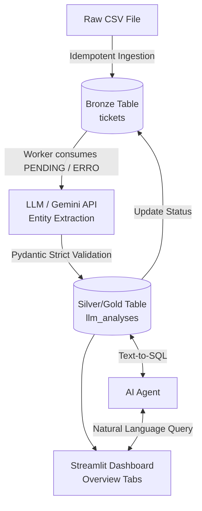
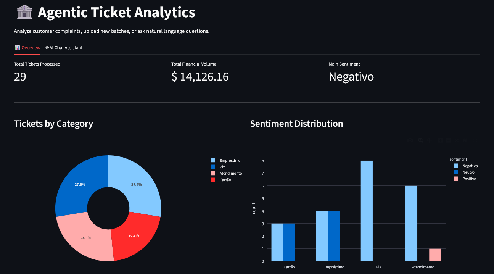
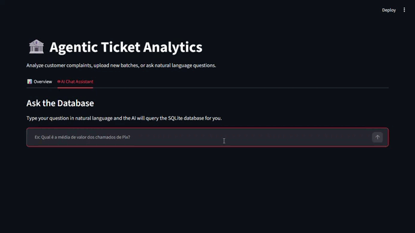

# Agentic Ticket Analytics | NLP-to-SQL Pipeline


A **Data Engineering & AI** pipeline designed to ingest, process, and structure raw customer complaints from the banking sector. The project uses Large Language Models (LLMs) to convert unstructured text into actionable metrics (Category, Financial Amount, and Sentiment), storing the results in a relational database (SQLite). 

It also features a **Streamlit Dashboard** powered by an **Agentic AI (Text-to-SQL)**, allowing users to query the database using natural language.

## 🏗️ Architecture Overview

The system follows a simplified Medallion Architecture, decoupling data ingestion from AI processing to ensure resilience and prevent data loss.



## ✨ Key Features
- **Decoupled & Idempotent Pipeline:** Ingestion and AI processing run independently. Processed files are archived to prevent data duplication.
- **Strict Data Contracts:** Uses `Pydantic` for runtime validation, type coercion, and hallucination blocking (forcing literal categories).
- **Resilience (DLQ Pattern):** Built-in exponential backoff for API rate limits (HTTP 429) and an automated retry mechanism for tickets marked as `ERRO`.
- **Agentic Analytics (Text-to-SQL):** Integrated LLM agent capable of translating user questions in Portuguese into valid, secure SQLite queries.
- **Interactive UI:** Streamlit-based web dashboard providing static KPIs, descriptive charts, and a dynamic AI chat assistant.


## 📊 Live Dashboard & AI Agent

**Overview Panel:** Provides high-level metrics and sentiment distribution.


**Agentic SQL Assistant:** Translates natural language into database queries instantly.



## 🚀 How to Run Locally

**1. Clone the repository**
```bash
git clone [https://github.com/joaosilva-watanabe/Agentic_Ticket_Analytics-NLP_to_SQL_Pipeline.git](https://github.com/joaosilva-watanabe/Agentic_Ticket_Analytics-NLP_to_SQL_Pipeline.git)
cd your-project-folder
```

**2. Set up the virtual environment**
```bash
python -m venv .venv
source .venv/Scripts/activate  # On Linux/Mac use: source .venv/bin/activate
pip install -r requirements.txt
```

**3. Configure Environment Variables**
Create a `.env` file in the root directory and add your Google Gemini API key:
```text
GEMINI_API_KEY=your_api_key_here
```

**4. Run the Pipeline (Backend)**
```bash
python main.py
```
*(Tip: You can use `python reset.py` to clear the database and restore the CSV for fresh testing).*

**5. Run the Dashboard (Frontend)**
```bash
streamlit run dashboard.py
```

## ⚠️ Design Principles & Architecture Decisions
- **"Global Code, Local Data" Principle:** The entire codebase—including variables, functions, logging, and documentation—is written strictly in **English** to maintain global engineering standards. However, the Agentic LLM and data processing layers are configured to seamlessly ingest, process, and output data in **Portuguese**, ensuring the final product remains fully localized for the end-user while the source code remains accessible to international teams.
- **Dynamic Schema Mapping:** Currently, the ingestion script expects a fixed CSV format with a specific column (`client_text`). Handling real-world, unstructured client datasets will require implementing an LLM-based schema mapping layer prior to ingestion.
- **Security & Arbitrary Code Execution:** Future implementation of AI-generated dynamic charts (Text-to-Chart) involves executing LLM-generated Python code via `exec()`. For production environments, this pipeline **must** be containerized using **Docker** to provide a secure sandbox execution environment, preventing system-level vulnerabilities.

## 🗺️ Roadmap (Next Steps)
- [x] Refactor the monolithic script into modular files (`database.py`, `extractor.py`, `agent.py`).
- [x] Replace `@dataclass` with `Pydantic` for strict runtime validation.
- [x] Build a Streamlit Dashboard to visualize ticket sentiments.
- [x] Implement Text-to-SQL Agent for natural language queries.
- [ ] Implement AI-generated dynamic charts (Text-to-Chart Agent).
- [ ] Add dynamic Schema Mapping for unstructured real-world CSV uploads.
- [ ] Containerize the application using Docker for secure execution sandboxing.
- [x] Update the README.md

---
**Author:** [João Rodrigues](www.linkedin.com/in/joaopedro-rsilva) - Statistics Student focused on Data Science, AI and Machine Learning.